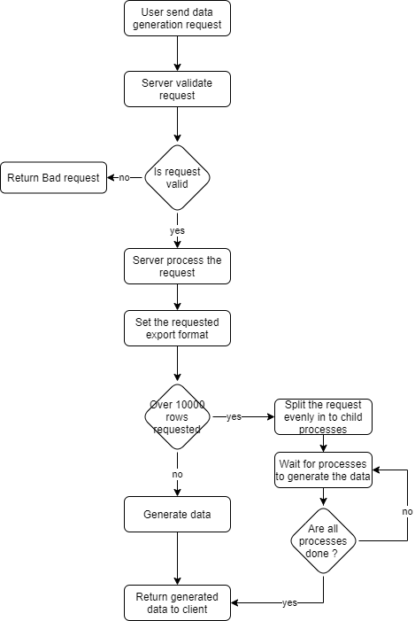

# 1. Introduction

## 1.1 Purpose
The purpose of this document is to get a detailed overview of which functionality is needed for "Mockdata Generator" application. The intended audience for this document are the developers to give a guidance of which functionality should or shall exist and the importance of the required functionality.

## 1.2 Scope
It seems that it does not exist any open-source project that allows an user to generate milions of rows of structured data that's free and simple to use. Therefore this project have been created.

## 1.3 Definitions, acronyms, and abbreviations

| Term | Definition |
| ---- | ---------- |
| HTTP | **H**yper**T**ext **T**ransport **P**rotocol |
| WCAG | **W**eb **C**ontent **A**ccessibility **G**uidelines |

# 2. Overall description

## 2.1 Product perspective
This applicaiton will be a web-based application, where the front-end will be a Single Page Application and backend will be a RESTapi. The frontend will communicate with the RESTapi over the HTTP/2 protocol.

The application will allow the user to create unlimited amount of named columns with typed data and then generate structured mock data depending on how many rows the user needs and export the generated data to a perferred format.
## 2.2 Product functions
The frontend will allow the user to specify what kind of data that the user want to generate. 

When the user have filled in the specification of wanted generated data, the frontend will send an api request to the backend.

The backend will in return, generate mock-data based of the inputs from the user, and then return the data in the specified format.

## 2.3 Intended users
The application is inteded for developers and testers that need mockdata.
## 2.4 Constraints
Because tha application will run as a back-end and front-end application, an internet connection will be needed, though it will be able to run it all on one single machine.

The application maybe used in the public domain, which may require request limiting or request queing, and therefore needs a way to to store temporary data.
## 2.5 References 
- Mockaroo.com | The project will take insperation from this site

# 3 requirements

## 3.1 Requirements layout
Requirements need to have the following layout:
- Requirment ID: ####
- Requirement type: SR, FR, EIR, NFR
    - SR - System requirement
    - FR - Functional requirement
    - EIR - External Interface Requirement
    - NFR - Non-Functional Requriement
- Priority: 1-5 (where 1 is urgent and 5 least urgent)
- Title: Short description of the requirement
- Content: Detailed information of the requiremnt
- Date of creation: YYYY-MM-DD

Example:
<table>
    <tbody>
        <tr>
            <td>
                Type: SR
            </td>
            <td>
                ID: 123
            </td>
            <td>
                DATE: 2021-02-14
            </td>
            <td>
                Priority: 1
            </td>
        </tr>
        <tr>
            <td colspan=4>
                This is the title of the requirement!
            </td>
        </tr>
        <tr>
            <td colspan=4>
                This is the description of the requirement
            </td>
        </tr>
    </tbody>
</table>

## 3.2 System requirements

<table>
    <tbody>
        <tr>
            <td>
                Type: SR
            </td>
            <td>
                ID: ###
            </td>
            <td>
                DATE: 2021-02-14
            </td>
            <td>
                Priority: 1
            </td>
        </tr>
        <tr>
            <td colspan=4>
                Shall support any Linux based operatingsystem
            </td>
        </tr>
        <tr>
            <td colspan=4>
                The application shall be able to be installed onto any linux distro that support NodeJS.
            </td>
        </tr>
    </tbody>
</table>

## 3.3 Functional requirements

<table>
    <tbody>
        <tr>
            <td>
                Type: FR
            </td>
            <td>
                ID: ###
            </td>
            <td>
                DATE: 2021-02-14
            </td>
            <td>
                Priority: 3
            </td>
        </tr>
        <tr>
            <td colspan=4>
                Parallel processing
            </td>
        </tr>
        <tr>
            <td colspan=4>
                When the x number of rows reaches a specific limit, seperate the generation in to other threads.
            </td>
        </tr>
    </tbody>
</table>

---

<table>
    <tbody>
        <tr>
            <td>
                Type: FR
            </td>
            <td>
                ID: ###
            </td>
            <td>
                DATE: 2021-02-14
            </td>
            <td>
                Priority: 1
            </td>
        </tr>
        <tr>
            <td colspan=4>
                Allow users to customize data generation
            </td>
        </tr>
        <tr>
            <td colspan=4>
                Let the user get the possibility to generate multiple columns of different data.
            </td>
        </tr>
    </tbody>
</table>

---

<table>
    <tbody>
        <tr>
            <td>
                Type: FR
            </td>
            <td>
                ID: ###
            </td>
            <td>
                DATE: 2021-02-14
            </td>
            <td>
                Priority: 1
            </td>
        </tr>
        <tr>
            <td colspan=4>
                Named columns
            </td>
        </tr>
        <tr>
            <td colspan=4>
                Let the user name their columns.
            </td>
        </tr>
    </tbody>
</table>

---

<table>
    <tbody>
        <tr>
            <td>
                Type: FR
            </td>
            <td>
                ID: ###
            </td>
            <td>
                DATE: 2021-02-14
            </td>
            <td>
                Priority: 1
            </td>
        </tr>
        <tr>
            <td colspan=4>
                Remove columns
            </td>
        </tr>
        <tr>
            <td colspan=4>
                Let the user remove columns from the wanted structure.
            </td>
        </tr>
    </tbody>
</table>

---

<table>
    <tbody>
        <tr>
            <td>
                Type: FR
            </td>
            <td>
                ID: ###
            </td>
            <td>
                DATE: 2021-02-14
            </td>
            <td>
                Priority: 1
            </td>
        </tr>
        <tr>
            <td colspan=4>
                Move columns
            </td>
        </tr>
        <tr>
            <td colspan=4>
                Let the user with drag and drop feature move columns in their wanted order.
            </td>
        </tr>
    </tbody>
</table>

---

<table>
    <tbody>
        <tr>
            <td>
                Type: FR
            </td>
            <td>
                ID: ###
            </td>
            <td>
                DATE: 2021-02-14
            </td>
            <td>
                Priority: 1
            </td>
        </tr>
        <tr>
            <td colspan=4>
                Allow column generation to depend on another column
            </td>
        </tr>
        <tr>
            <td colspan=4>
                Let user set columns to be dependet of each other.
            </td>
        </tr>
    </tbody>
</table>

---

<table>
    <tbody>
        <tr>
            <td>
                Type: FR
            </td>
            <td>
                ID: ###
            </td>
            <td>
                DATE: 2021-02-14
            </td>
            <td>
                Priority: 1
            </td>
        </tr>
        <tr>
            <td colspan=4>
                Multiple table generation
            </td>
        </tr>
        <tr>
            <td colspan=4>
                Allow the user to generate multiple sets of data.
            </td>
        </tr>
    </tbody>
</table>

---

<table>
    <tbody>
        <tr>
            <td>
                Type: FR
            </td>
            <td>
                ID: ###
            </td>
            <td>
                DATE: 2021-02-14
            </td>
            <td>
                Priority: 1
            </td>
        </tr>
        <tr>
            <td colspan=4>
                Export to different format
            </td>
        </tr>
        <tr>
            <td colspan=4>
                Allow the user to export the data into different formats, for example but not limited to:
                <ul>
                    <li>SQL (MySQL, PostGresql)</li>
                    <li>JSON</li>
                    <li>CSV</li>
                    <li>XML</li>
                    <li>Excel</li>
                </ul>
            </td>
        </tr>
    </tbody>
</table>

---

<table>
    <tbody>
        <tr>
            <td>
                Type: FR
            </td>
            <td>
                ID: ###
            </td>
            <td>
                DATE: 2021-02-14
            </td>
            <td>
                Priority: 1
            </td>
        </tr>
        <tr>
            <td colspan=4>
                Set generated number of rows
            </td>
        </tr>
        <tr>
            <td colspan=4>
                Allow the user to set the amount of rows that needs to be generated
            </td>
        </tr>
    </tbody>
</table>

---

<table>
    <tbody>
        <tr>
            <td>
                Type: FR
            </td>
            <td>
                ID: ###
            </td>
            <td>
                DATE: 2021-02-14
            </td>
            <td>
                Priority: 1
            </td>
        </tr>
        <tr>
            <td colspan=4>
                SQL-format
            </td>
        </tr>
        <tr>
            <td colspan=4>
                Let the user choose if the SQL-formatted data should create a table and name the table
            </td>
        </tr>
    </tbody>
</table>

---

<table>
    <tbody>
        <tr>
            <td>
                Type: FR
            </td>
            <td>
                ID: ###
            </td>
            <td>
                DATE: 2021-02-14
            </td>
            <td>
                Priority: 1
            </td>
        </tr>
        <tr>
            <td colspan=4>
                JSON-format
            </td>
        </tr>
        <tr>
            <td colspan=4>
                Allow the user to nest fields by using "." notation
            </td>
        </tr>
    </tbody>
</table>

---

<table>
    <tbody>
        <tr>
            <td>
                Type: FR
            </td>
            <td>
                ID: ###
            </td>
            <td>
                DATE: 2021-02-14
            </td>
            <td>
                Priority: 1
            </td>
        </tr>
        <tr>
            <td colspan=4>
                Sending the data without saving to disk on host
            </td>
        </tr>
        <tr>
            <td colspan=4>
                After the data have been generated, send the data as a stream instead of saving it to the disk on the host. See <a href='https://stackoverflow.com/questions/21578208/node-js-send-file-to-client'>StackOverflow</a>
            </td>
        </tr>
    </tbody>
</table>

## 3.3 External interface requirements

---

<table>
    <tbody>
        <tr>
            <td>
                Type: EIR
            </td>
            <td>
                ID: ###
            </td>
            <td>
                DATE: 2021-02-14
            </td>
            <td>
                Priority: 1
            </td>
        </tr>
        <tr>
            <td colspan=4>
                Backend programming language
            </td>
        </tr>
        <tr>
            <td colspan=4>
                The backend will be programmed in NodeJS
            </td>
        </tr>
    </tbody>
</table>

---

<table>
    <tbody>
        <tr>
            <td>
                Type: EIR
            </td>
            <td>
                ID: ###
            </td>
            <td>
                DATE: 2021-02-14
            </td>
            <td>
                Priority: 1
            </td>
        </tr>
        <tr>
            <td colspan=4>
                Frontend framework
            </td>
        </tr>
        <tr>
            <td colspan=4>
                The frontend framework will be Angular (Not AngularJS)
            </td>
        </tr>
    </tbody>
</table>

---

<table>
    <tbody>
        <tr>
            <td>
                Type: EIR
            </td>
            <td>
                ID: ###
            </td>
            <td>
                DATE: 2021-02-14
            </td>
            <td>
                Priority: 1
            </td>
        </tr>
        <tr>
            <td colspan=4>
                Frontend and Backend flavour
            </td>
        </tr>
        <tr>
            <td colspan=4>
                Both the frontend and backend need to be using TypeScript
            </td>
        </tr>
    </tbody>
</table>

---

<table>
    <tbody>
        <tr>
            <td>
                Type: EIR
            </td>
            <td>
                ID: ###
            </td>
            <td>
                DATE: 2021-02-14
            </td>
            <td>
                Priority: 1
            </td>
        </tr>
        <tr>
            <td colspan=4>
                Backend framework
            </td>
        </tr>
        <tr>
            <td colspan=4>
                The backend framework needs to be ExpressJS
            </td>
        </tr>
    </tbody>
</table>

---

<table>
    <tbody>
        <tr>
            <td>
                Type: EIR
            </td>
            <td>
                ID: ###
            </td>
            <td>
                DATE: 2021-02-14
            </td>
            <td>
                Priority: 1
            </td>
        </tr>
        <tr>
            <td colspan=4>
                Communication between frontend and backend
            </td>
        </tr>
        <tr>
            <td colspan=4>
                The backend need to follow the REST API standard to allow an ease communication between frontend and backend.
            </td>
        </tr>
    </tbody>
</table>

---

<table>
    <tbody>
        <tr>
            <td>
                Type: EIR
            </td>
            <td>
                ID: ###
            </td>
            <td>
                DATE: 2021-02-14
            </td>
            <td>
                Priority: 1
            </td>
        </tr>
        <tr>
            <td colspan=4>
                REST API over HTTP
            </td>
        </tr>
        <tr>
            <td colspan=4>
                The REST API need to communicate over HTTP.
                Nice to have: Instead of HTTP, support HTTP2.
            </td>
        </tr>
    </tbody>
</table>

---

<table>
    <tbody>
        <tr>
            <td>
                Type: EIR
            </td>
            <td>
                ID: ###
            </td>
            <td>
                DATE: 2021-02-14
            </td>
            <td>
                Priority: 1
            </td>
        </tr>
        <tr>
            <td colspan=4>
                Screen sizes
            </td>
        </tr>
        <tr>
            <td colspan=4>
                The frontend need to support a minimal screensize of: 1366 x 768
                The frontend need to support a maximal screensize of: 3840 x 2160
            </td>
        </tr>
    </tbody>
</table>

---

<table>
    <tbody>
        <tr>
            <td>
                Type: EIR
            </td>
            <td>
                ID: ###
            </td>
            <td>
                DATE: 2021-02-14
            </td>
            <td>
                Priority: 1
            </td>
        </tr>
        <tr>
            <td colspan=4>
                Screen sizes
            </td>
        </tr>
        <tr>
            <td colspan=4>
                The frontend need to support a minimal screensize of: 1366 x 768
                The frontend need to support a maximal screensize of: 3840 x 2160
            </td>
        </tr>
    </tbody>
</table>

---

<table>
    <tbody>
        <tr>
            <td>
                Type: EIR
            </td>
            <td>
                ID: ###
            </td>
            <td>
                DATE: 2021-02-14
            </td>
            <td>
                Priority: 1
            </td>
        </tr>
        <tr>
            <td colspan=4>
                Identify logged in users
            </td>
        </tr>
        <tr>
            <td colspan=4>
                User identity will be verfied with JSON Web Token.
            </td>
        </tr>
    </tbody>
</table>

---

<table>
    <tbody>
        <tr>
            <td>
                Type: EIR
            </td>
            <td>
                ID: ###
            </td>
            <td>
                DATE: 2021-02-14
            </td>
            <td>
                Priority: 1
            </td>
        </tr>
        <tr>
            <td colspan=4>
                In-memory Database
            </td>
        </tr>
        <tr>
            <td colspan=4>
                For rate-limit, an in-memory database is needed for fast transactions. The database Redis will be used.
            </td>
        </tr>
    </tbody>
</table>

---

<table>
    <tbody>
        <tr>
            <td>
                Type: EIR
            </td>
            <td>
                ID: ###
            </td>
            <td>
                DATE: 2021-02-14
            </td>
            <td>
                Priority: 1
            </td>
        </tr>
        <tr>
            <td colspan=4>
                Estimate time
            </td>
        </tr>
        <tr>
            <td colspan=4>
                Inform the user the estimate time for the data generation.
            </td>
        </tr>
    </tbody>
</table>

---

<table>
    <tbody>
        <tr>
            <td>
                Type: EIR
            </td>
            <td>
                ID: ###
            </td>
            <td>
                DATE: 2021-02-14
            </td>
            <td>
                Priority: 1
            </td>
        </tr>
        <tr>
            <td colspan=4>
                Duration time
            </td>
        </tr>
        <tr>
            <td colspan=4>
                Show the user the duration while the file is being generated.
            </td>
        </tr>
    </tbody>
</table>

---

<table>
    <tbody>
        <tr>
            <td>
                Type: EIR
            </td>
            <td>
                ID: ###
            </td>
            <td>
                DATE: 2021-02-14
            </td>
            <td>
                Priority: 1
            </td>
        </tr>
        <tr>
            <td colspan=4>
                Parallel jobs status
            </td>
        </tr>
        <tr>
            <td colspan=4>
                Inform the user when one of the parallel jobs are done.
            </td>
        </tr>
    </tbody>
</table>

---

<table>
    <tbody>
        <tr>
            <td>
                Type: EIR
            </td>
            <td>
                ID: ###
            </td>
            <td>
                DATE: 2021-02-14
            </td>
            <td>
                Priority: 1
            </td>
        </tr>
        <tr>
            <td colspan=4>
                Data generation
            </td>
        </tr>
        <tr>
            <td colspan=4>
                Use of faker.js library to generate data as much as possible.
                 
                When faker.js does not meet the critera for the specific job, then it shall be possible to add custom made generation algorithms.
            </td>
        </tr>
    </tbody>
</table>

---

<table>
    <tbody>
        <tr>
            <td>
                Type: EIR
            </td>
            <td>
                ID: ###
            </td>
            <td>
                DATE: 2021-02-14
            </td>
            <td>
                Priority: 1
            </td>
        </tr>
        <tr>
            <td colspan=4>
                Userfriendly frontend
            </td>
        </tr>
        <tr>
            <td colspan=4>
                The frontend need to be userfriendly and support screen-readers and ease to use for colorblind and blind users. The text layout shall follow 
            </td>
        </tr>
    </tbody>
</table>

---

<table>
    <tbody>
        <tr>
            <td>
                Type: EIR
            </td>
            <td>
                ID: ###
            </td>
            <td>
                DATE: 2021-02-14
            </td>
            <td>
                Priority: 1
            </td>
        </tr>
        <tr>
            <td colspan=4>
                Follow WCAG 2.1
            </td>
        </tr>
        <tr>
            <td colspan=4>
                The frontend need to follow the following standards of WCAG 2.1:
                <ul>
                    <li><a href="https://www.w3.org/WAI/WCAG21/quickref/#use-of-color">1.4.1 Use of Colors</a></li>
                    <li><a href="https://www.w3.org/WAI/WCAG21/quickref/#contrast-minimum">1.4.3 Contrast (Minimum)</a></li>
                    <li><a href="https://www.w3.org/WAI/WCAG21/quickref/#resize-text">1.4.4 Resize text</a></li>
                    <li><a href="https://www.w3.org/WAI/WCAG21/quickref/#text-spacing">1.4.11 Text Spacing</a></li>
                    <li><a href="https://www.w3.org/WAI/WCAG21/quickref/#keyboard">2.1 Keyboard Accessible</a></li>
                    <li><a href="https://www.w3.org/WAI/WCAG21/quickref/#pause-stop-hide">2.2 Enough Time</a></li>
                    <li><a href="https://www.w3.org/WAI/WCAG21/quickref/#label-in-name">2.5 Input modalities</a></li>
                    <li><a href="https://www.w3.org/WAI/WCAG21/quickref/#language-of-page">3 Understandable</a></li>
                </ul>
            </td>
        </tr>
    </tbody>
</table>

## 3.4 Non-functional requirements

<table>
    <tbody>
        <tr>
            <td>
                Type: NFR
            </td>
            <td>
                ID: ###
            </td>
            <td>
                DATE: 2021-02-14
            </td>
            <td>
                Priority: 1
            </td>
        </tr>
        <tr>
            <td colspan=4>
                Datageneration performance
            </td>
        </tr>
        <tr>
            <td colspan=4>
                For each column per 1 milion row, should follow an liniar increasment of maximum 2.0 seconds.
                Example:  
                User want to generate 1 milion rows with 10 columns, the expected time should be 20.0 seconds.
            </td>
        </tr>
    </tbody>
</table>

---

<table>
    <tbody>
        <tr>
            <td>
                Type: NFR
            </td>
            <td>
                ID: ###
            </td>
            <td>
                DATE: 2021-02-14
            </td>
            <td>
                Priority: 1
            </td>
        </tr>
        <tr>
            <td colspan=4>
                Datageneration performance
            </td>
        </tr>
        <tr>
            <td colspan=4>
                For each column per 1 milion row, should follow an liniar increasment of maximum 2.0 seconds.
                Example:  
                User want to generate 1 milion rows with 10 columns, the expected time should be 20.0 seconds.
            </td>
        </tr>
    </tbody>
</table>

---

<table>
    <tbody>
        <tr>
            <td>
                Type: NFR
            </td>
            <td>
                ID: ###
            </td>
            <td>
                DATE: 2021-02-14
            </td>
            <td>
                Priority: 1
            </td>
        </tr>
        <tr>
            <td colspan=4>
                Testing
            </td>
        </tr>
        <tr>
            <td colspan=4>
                Atleast 80% of the code in the backend should be covered in with tests.
            </td>
        </tr>
    </tbody>
</table>

---

<table>
    <tbody>
        <tr>
            <td>
                Type: NFR
            </td>
            <td>
                ID: ###
            </td>
            <td>
                DATE: 2021-02-14
            </td>
            <td>
                Priority: 1
            </td>
        </tr>
        <tr>
            <td colspan=4>
                Request Limiter
            </td>
        </tr>
        <tr>
            <td colspan=4>
                The application should be able to handle request limiting that's configureble.
            </td>
        </tr>
    </tbody>
</table>

---

<table>
    <tbody>
        <tr>
            <td>
                Type: NFR
            </td>
            <td>
                ID: ###
            </td>
            <td>
                DATE: 2021-02-14
            </td>
            <td>
                Priority: 1
            </td>
        </tr>
        <tr>
            <td colspan=4>
                Code standard
            </td>
        </tr>
        <tr>
            <td colspan=4>
                All code need to follow the eslint standard, that's included to the project.
            </td>
        </tr>
    </tbody>
</table>

---

<table>
    <tbody>
        <tr>
            <td>
                Type: NFR
            </td>
            <td>
                ID: ###
            </td>
            <td>
                DATE: 2021-02-14
            </td>
            <td>
                Priority: 1
            </td>
        </tr>
        <tr>
            <td colspan=4>
                Code readability
            </td>
        </tr>
        <tr>
            <td colspan=4>
                <ul>
                    <li>Don’t use abbreviations</li>
                    <li>Name functions what they do, if the name gets to long, then the function may be needs to be refactored</li>
                    <li>Name variables what they contains or what they are inteded to be used for</li>
                    <li>Follow DRY, Don't Repeat Yourself, principle</li>
                    <li>Don't use generic names for functions, classes or variables.</li>
                </ul>
            </td>
        </tr>
    </tbody>
</table>
