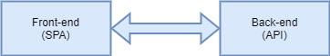
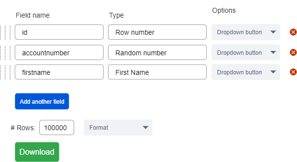

# 1. Introduction

## 1.1 Purpose
The purpose of this document is to get a detailed overview of which functionality is needed for "Mockdata Generator" application. The intended audience for this document are the developers to give a guidance of which functionality should or shall exist and the importance of the required functionality.

## 1.2 Scope
It seems that it does not exist any open-source project that allows an user to generate milions of rows of structured data that's free and simple to use. Therefore this project have been created.

## 1.3 Definitions, acronyms, and abbreviations

| Term | Definition |
| ---- | ---------- |
| A term | A definition |

# 2. Overall description

## 2.1 Product perspective
This applicaiton will be a web-based application, where the front-end will be a Single Page Application and backend will be a RESTapi. The frontend will communicate with the RESTapi over the HTTP/2 protocol.

The application will allow the user to create unlimited amount of named columns with typed data and then generate structured mock data depending on how many rows the user needs and export the generated data to a perferred format.
## 2.2 Product functions
The front-end will allow the user to specify what kind of data that the user want to generate. When the user have filled in the specification of wanted generated data, the front-end will send an api request to the backend.

The back-end will in return, generate mock-data based of the inputs from the user, and then return the data in the specified format.
## 2.3 Intended users
The application is inteded for developers and testers that need mockdata.
## 2.4 Constraints
Because tha application will run as a back-end and front-end application, an internet connection will be needed, though it will be able to run it all on one single machine.

The application maybe used in the public domain, which may require request limiting or request queing, and therefore needs a way to to store temporary data.
## 2.5 References 
- Mockaroo.com | The project will take insperation from this site

# 3 requirements

## 3.1 Requirements layout
Requirements need to have the following layout:
- Requirment ID: ####
- Requirement type: SR, FR, EIR, NFR
- Priority: 1-5 (where 1 is urgent and 5 least urgent)
- Title: Short description of the requirement
- Content: Detailed information of the requiremnt
- Date of creation: YYYY-MM-DD

Example:

| 123 | 2021-02-14 | Priority: 1 | 
| --- | ---------- | ----------- |
<td colspan=3> This is a test title
<td colspan=3> This is the description

## 3.2 System requirements and functional requirements

The functional requirements or the overall description documents include the product perspective and features, operating system and operating environment, graphics requirements, design constraints and user documentation.

The appropriation of requirements and implementation constraints gives the general overview of the project in regards to what the areas of strength and deficit are and how to tackle them.

## 3.3 External interface requirements
Interface requirements consist of the hardware and the software interfaces along with user and communication interfaces.

- User interfaces consist of the style guides, screen layout, buttons, functions.
- The software interfaces consists of the platform, database system, front end and the backend framework, operating systems, tools and libraries.
- Hardware interfaces includes details of the hardware components like the list of supported devices, nature of data and the hardware-software interactions.
- Communications interfaces are the network server communications protocols. The requirements determine the communication standards to be utilized.

## 3.4 Non-functional requirements
The non-functional requirements constitute the following:

- Performance requirements
- Safety requirements
- Security requirements
- Software quality attributes
- Other requirements
